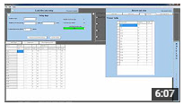

# me-school-exam-timetable-scheduler
Application that deals with the planning of school exam schedules

### Overview
Covers the main aspects of setting up an exam schedule: Tests, Venues, Supervisors.

### Video

### Features
- Test scheduling
- Venue allocation
- Supervisor allocation
- Reporting

### Technologies
- Delphi

### Shortfalls
- Text storage instead of database
- Some bugs

### Resources
- [Dist](dist.zip)
- Manual (Incomplete)
 - [Powerpoint](user-manual.ppt)
 - [PDF](user-manual.pdf)

